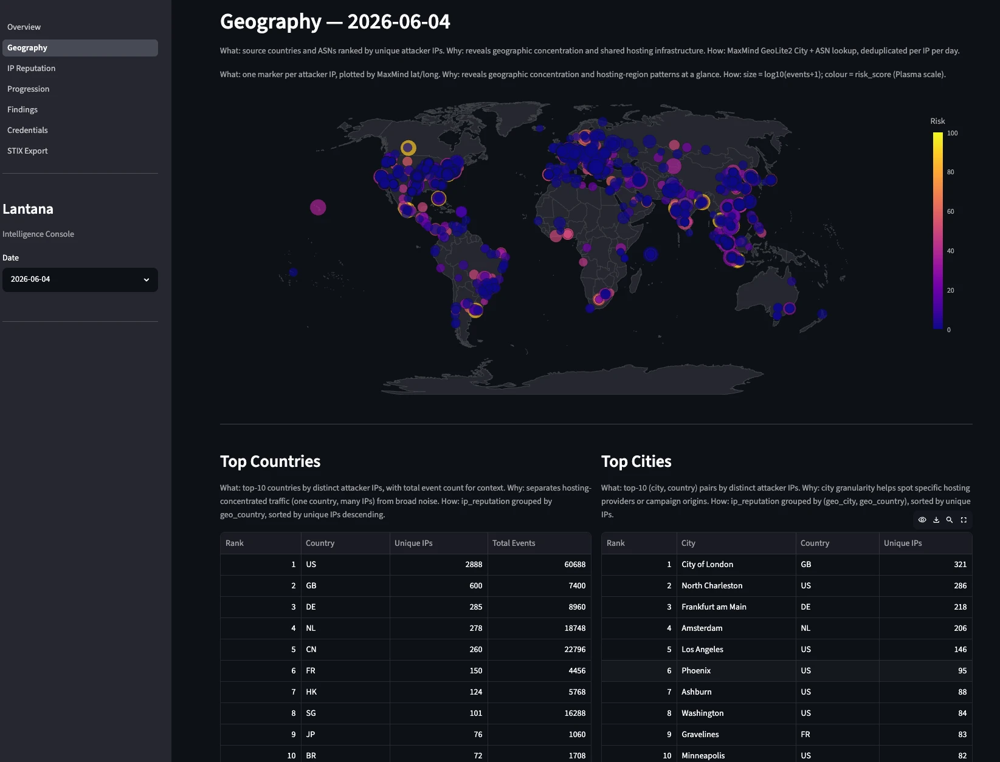

In the [previous post](/log/lantana-1-honeypot-as-code/), I showed my motivation to create Lantana, early development, technical stack, and the Alpha version delivery. After that, I took a strategic pause to learn more about AI and understand what had changed during that period to justify the buzz I was seeing in my network. After around a month playing with **Claude Opus 4.5** and **Claude Code**, I could see the hype was real: AI was more helpful and precise than ever. Inevitably, I started envisioning how helpful it would be for Lantana, and by late April, [I onboarded Claude to Lantana](https://github.com/lopes/lantana/commit/f6f69f54e33932bae3dc7592d65073c9c868deec).

This post tells how I leveraged AI here and how it greatly increased the development speed. The story told here took place between late April and late May, 2026 — one month, roughly. This timeframe is important because it was enough to move from an Alpha version to a Release Candidate. One person, not full-time allocated, some days off, no weekend work.

Code on [GitHub](https://github.com/lopes/lantana).

## Full Review

Having learned best practices on working with AI, I resumed the work with Lantana by asking Claude to review the codebase to spot and fix errors and inconsistencies. It found many low- and medium-severity issues that required changes, especially in shell scripts and configuration files. The programming skills of Claude Code are unbeatable. It was especially helpful dealing with Ansible and Linux configuration files (like systemd and logrotate), things that are predictable but require extra attention.

To my surprise, it approved all major technical decisions, so the stack remained the same. The only pivotal change it made was to the pipeline: instead of using Vector to parse logs to OCSF format, it suggested limiting its use to IP geolocation enrichment and forwarding the logs to the Bronze layer. All parsing would be done in Python because doing so would make future maintenance easier and yield better code overall. It would also better match the Medallion architecture, as the Bronze layer expects raw logs.

A small caveat here: besides planning to leverage OCSF, Claude pushed back to keep things practical. Since the Silver layer uses Parquet files, and working with deeply nested structs adds tooling complexity, storing `src_endpoint.ip`-style fields would make downstream querying harder. We decided to flatten all fields instead, creating an OCSF-inspired schema. Fields remain deterministic without the extra complexity.

While onboarding Claude, I also reconsidered the use of auth logs. Although useful for incident investigation, including them in datasets would add noise without meaningful signal, so we dropped them. The new diagram looked like this:

```{mermaid}
flowchart TD
  ATK(["Attacker"])

  subgraph HWZ["HONEYWALL ZONE"]
  NFT["nftables<br/>packet filter + log"]
  SUR["Suricata<br/>NIDS"]
  end

  subgraph SENS["SENSOR ZONE"]
  COW["Cowrie<br/>SSH, Telnet"]
  DIO["Dionaea<br/>HTTP, MySQL…"]
  end

  subgraph CLZ["COLLECTOR ZONE"]
  subgraph STREAM["Vector (all zones)"]
    GEO["GeoIP<br/>MaxMind GeoLite2"]
  end
  BRZ[("🥉 BRONZE<br/>raw, GeoIP")]
  subgraph BATCH["D+1"]
    NRM["OCSF normalization"] --> IOC["IOC extraction"] --> CACHE[("cache")]
    CACHE -- "miss" --> EXT["VirusTotal, GreyNoise…"]
    EXT -- "store" --> CACHE
  end
  SLV[("🥈 SILVER<br/>normalized, enriched")]
  GLD[("🥇 GOLD<br/>top IPs, credentials, geo…")]

  GEO --> BRZ --> NRM
  CACHE -- "enriched" --> SLV --> GLD
  end

  ATK -. "attack traffic" .-> NFT
  NFT -. "attack traffic" .-> SENS

  NFT & SUR -- "logs" --> GEO
  COW & DIO -- "commands, credentials, files…" --> GEO
```

With Claude joining the team and eager to help, it was time to finally start the core of this work: Create the data pipeline and the data lake.

## Data Pipeline Development

Right after reviewing and improving the codebase, Opus started what I was calling "Phase 2": the data pipeline implementation. After a few rounds of back-and-forth with Claude to plan the tasks (including letting it interview me) I gave it green light to start coding. I instructed it to follow Test-Driven Development (TDD) and moved to the passenger seat to watch it work. I asked it to create a phased plan, grouping tasks by functionality, and it was a good call. I was aware I had to keep the context window under control, and with so many tasks it would inevitably fill at some point. We'd need to pause and restart in a new session — I prefer that over simply compacting the current context.

::: {.callout-note}
After watching [Steve Yegge's episode](https://www.youtube.com/watch?v=aFsAOu2bgFk) on **The Pragmatic Engineer** podcast, I decided to (even reluctantly) leave the driver's seat. Just like Steve, I spent some days mourning and realizing AI was commoditizing code. When I envisioned Lantana, I thought I'd use it to learn more about Python's data features and important libraries like Polars and Streamlit.

After learning the new AI capabilities, I realized my new role was closer to that of an orchestrator, a peer reviewer, a guide to Claude. All development would be done by my new ~~tool~~ ~~peer~~ ally. For a few days, my life became monochromatic but eventually I saw the upside and opportunities the new era was offering, and decided to fully embrace it. I started letting Claude assume the driver's seat in some moments.
:::

Once we reached around 50% of the context window, I instructed it to wrap up, persist lessons learned, and update the plan (I asked Claude to persist it in a temporary `PLAN.md` file). It took around four sessions before Claude considered the plan finished. By then, we had plenty of unit tests in place to ensure new code wouldn't break existing functionality. At that point, Claude confirmed we had a working pipeline, but I was skeptical. So I started asking it to create scripts to reprocess logs from the Alpha version — recall from the last post that I left it running early in March. I pulled the raw logs from the server and started testing locally.

Claude and I found many bugs triggering the enrichment and transformation routines (Silver and Gold, respectively). Once they were all fixed, I had better confidence it would work in production. Since Alpha was stable and collecting data, I wanted to replace it with a solid version. Next, I wanted to verify the third-party enrichments were working as expected, so I asked Claude to create a script to let me check them. During this validation, I found many bugs, mostly from poorly implemented API consumption. It was during this step that, due to numerous errors trying to use [Phishstats](https://phishstats.info/), I decided to drop support for it.

While validating the enrichment code, I noticed it was taking too long to process. Processing a full day's logs was taking around six hours. Analyzing the logs, I noticed that most of the time the pipeline was trying to enrich data from external services — but as my quotas were exhausted, it was in vain. Then it clicked: check whether the previous N enrichment attempts had failed due to rate-limit errors. If so, skip external enrichment entirely for the remaining logs. After raising this with Claude, it promptly acknowledged and implemented the fix. After that, the whole enrichment pipeline ran in less than five minutes, a ~99% drop. In my opinion, this perfectly exemplifies my work with AI on this project. Alone, neither of us would have yielded that result; working as a team, we achieved something neither could alone.

All of this happened in roughly one week: onboard Claude, review the codebase, implement and test the pipeline. I declared the version stable enough to move to the VPS and did so on May 23rd — the **Beta version**, the first end-to-end version deployed to the VPS, from server setup to dashboard generation. When I first envisioned this project, I was prepared to spend months working in this pipeline but the new way of work with AI greatly accelerated things. Not in my wildest dreams would I have imagined creating all of that in less than one week.

## A Working Pipeline

While the Beta version was running, I started reviewing my notes and analyzing reports to tune minor details. Coming from Detection Engineering, I know that not all IOCs are equal, so I reconsidered the TTLs used in cached IOCs for third-party enrichment. I defined that benign IOCs (not flagged as malicious by the platforms) would expire in one week. Malicious ones would vary by type: 28 days for IP addresses and domains, and 56 days for hashes. The underlying logic was: if something is benign, it can become malicious faster than something malicious can become benign.

At this point I could witness the data pipeline working for the first time, and I must admit it felt amazing. Raw logs from Cowrie were written to disk like this:

```json
{"eventid":"cowrie.session.connect","timestamp":"2026-06-07T00:00:18.800035Z","src_ip":"101.36.122.139","src_port":52912,"dst_ip":"::ffff:203.0.113.97","dst_port":2222,"session":"0c3197d4ef25","message":"New connection: 101.36.122.139:52912 (::ffff:203.0.113.97:2222) [session: 0c3197d4ef25]","sensor":"1e4f54c1da3d","protocol":"ssh"}

{"eventid":"cowrie.client.version","timestamp":"2026-06-07T00:00:18.800937Z","src_ip":"101.36.122.139","session":"0c3197d4ef25","version":"SSH-2.0-libssh_0.9.6","message":"Remote SSH version: SSH-2.0-libssh_0.9.6","sensor":"1e4f54c1da3d","protocol":"ssh"}

{"eventid":"cowrie.login.failed","timestamp":"2026-06-07T00:00:19.906380Z","src_ip":"101.36.122.139","username":"igor","password":"igor123","session":"0c3197d4ef25","message":"login attempt [igor/igor123] failed","sensor":"1e4f54c1da3d","protocol":"ssh"}
```

Vector picks up the raw log, adds pipeline metadata (dataset, operation, source_type, server), and runs an offline MaxMind GeoLite2 lookup at wire speed — no external API call, no latency. The geo struct is the only enrichment at this stage, as seen in the next listing.

```json
{
  "eventid": "cowrie.session.connect",
  "timestamp": "2026-06-07T00:00:18.800035Z",
  "src_ip": "101.36.122.139",
  "src_port": 52912,
  "dst_ip": "::ffff:203.0.113.97",
  "dst_port": 2222,
  "session": "0c3197d4ef25",
  "message": "New connection: 101.36.122.139:52912 (::ffff:203.0.113.97:2222) [session: 0c3197d4ef25]",
  "sensor": "1e4f54c1da3d",
  "protocol": "ssh",
  "dataset": "cowrie",
  "operation": "Alpha",
  "server": "sn-01",
  "source_type": "vector",
  "geo": {
    "asn": 135377,
    "isp": "UCLOUD INFORMATION TECHNOLOGY HK LIMITED",
    "city": "Hong Kong",
    "country_code": "HK",
    "latitude": 22.2842,
    "longitude": 114.1759,
    "region_code": null,
    "timezone": "Asia/Hong_Kong"
  }
}
{
  "eventid": "cowrie.login.failed",
  "timestamp": "2026-06-07T00:00:19.906380Z",
  "src_ip": "101.36.122.139",
  "username": "igor",
  "password": "igor123",
  "session": "0c3197d4ef25",
  "message": "login attempt [igor/igor123] failed",
  "sensor": "1e4f54c1da3d",
  "protocol": "ssh",
  "dataset": "cowrie",
  "operation": "Alpha",
  "server": "sn-01",
  "source_type": "vector",
  "geo": {
    "asn": 135377,
    "isp": "UCLOUD INFORMATION TECHNOLOGY HK LIMITED",
    "city": "Hong Kong",
    "country_code": "HK",
    "latitude": 22.2842,
    "longitude": 114.1759,
    "region_code": null,
    "timezone": "Asia/Hong_Kong"
  }
}
```

Then, every day after midnight, the ETL runs, rotating raw logs and starting the normalization and enrichment routines that produced the Silver layer — stored on disk as Parquet. The pipeline normalizes Cowrie's field names to the OCSF-inspired schema, enriches against AbuseIPDB and VirusTotal (daily batch, HTTP APIs), and redacts the honeypot's destination IP (`dst_endpoint_ip: null`) to prevent WAN IP leakage into reports. One row per event; null columns exist for event types that don't apply (e.g., `command` and `file_*` are null for a login event).

Another important task performed at this stage is WAN IP redaction. Doing it here avoids possible leaks in reports and enables safe data sharing. If two practitioners or companies run their own Lantana instances and want to share information, they can do so freely by exchanging Parquet or STIX files — Lantana guarantees no sensitive information is present in the Silver layer or beyond.

```json
{
  "dataset": "cowrie",
  "time": "2026-06-07 00:00:19.906380",
  "session": "0c3197d4ef25",

  "src_endpoint_ip": "101.36.122.139",
  "dst_endpoint_ip": null,

  "user_name": "igor",
  "unmapped_password": "igor123",
  "auth_protocol": "ssh",
  "is_cleartext": true,

  "class_uid": 3002,
  "category_uid": 3,
  "type_uid": 300201,
  "activity_id": 1,
  "status_id": 2,
  "severity_id": 2,
  "metadata_version": "1.3.0",
  "metadata_product_name": "Lantana",

  "geo.country_code": "HK",
  "geo.city": "Hong Kong",
  "geo.asn": 135377,
  "geo.isp": "UCLOUD INFORMATION TECHNOLOGY HK LIMITED",
  "geo.latitude": 22.2842,
  "geo.longitude": 114.1759,
  "geo.timezone": "Asia/Hong_Kong",

  "abuseipdb_confidence_score": 100,
  "abuseipdb_total_reports": 6638,
  "abuseipdb_risk_score": 100.0,

  "vt_malicious_count": 12,
  "vt_suspicious_count": 3,
  "vt_ip_reputation": -8,
  "vt_as_owner": "UCLOUD INFORMATION TECHNOLOGY (HK) LIMITED",
  "virustotal_risk_score": 100.0,

  "shodan_risk_score": null,
  "greynoise_risk_score": null,

  "message": "login attempt [igor/igor123] failed",
  "operation": "Alpha",
  "server": "sn-01",
  "sensor": "1e4f54c1da3d"
}
```

Just out of curiosity, the Appendix brings a table with all field mappings, from raw logs to OCSF format.

### Risk Score

Note that each third-party enrichment brings its own **risk score**. While validating Lantana, I wanted a single number, 0 to 100, to express how risky an IOC appears to Lantana. Claude and I worked it out as follows:

- On the Silver layer, each third-party enrichment module has a routine that calculates a local risk score based on the response from that source — usually a lookup table like "if value X from VirusTotal is between Y and Z, score is W." Multiple sources, multiple local risk scores.
- On the Gold layer, all collected risk scores are combined by taking the mean across third-party sources, giving the **Enrichment Risk Score**. Separately, based on events collected by Lantana and associated with that IOC, we calculate a **Behavioral Risk Score**. The **total Risk Score** for an IOC is the average of these two. The higher the number, the more risk it presents from Lantana's perspective — and this score travels with the indicator's data.

The Gold layer is one row per attacker IP per day, as shown below. The pipeline aggregates all 96 events from this IP across both honeypots (Cowrie + Suricata), counts credentials, and computes a composite risk score from enrichment sub-scores (AbuseIPDB + VirusTotal = 100.0) and behavioral signals (16 auth attempts, 0 commands, 0 downloads = 1.6). Final score: (100.0 + 1.6) / 2 = 50.8.

```json
{
  "src_endpoint_ip": "101.36.122.139",

  "total_events": 96,
  "datasets": ["suricata", "cowrie"],
  "auth_attempts": 16,
  "auth_successes": 0,
  "unique_usernames": 3,
  "unique_passwords": 4,
  "commands_executed": 0,
  "findings_triggered": 0,
  "downloads": 0,

  "first_seen": "2026-06-07 00:00:18.800035",
  "last_seen": "2026-06-07 00:06:08.498538",

  "geo_country": "HK",
  "geo_city": "Hong Kong",
  "geo_asn": 135377,
  "geo_isp": "UCLOUD INFORMATION TECHNOLOGY HK LIMITED",
  "geo_latitude": 22.2842,
  "geo_longitude": 114.1759,

  "abuseipdb_score": 100,
  "abuseipdb_reports": 6638,
  "vt_malicious": 12,
  "vt_reputation": -8,
  "greynoise_class": null,
  "greynoise_noise": null,
  "shodan_ports": null,

  "abuseipdb_risk_score": 100.0,
  "virustotal_risk_score": 100.0,
  "shodan_risk_score": null,
  "greynoise_risk_score": null,
  "enrichment_risk_score": 100.0,
  "behavioral_risk_score": 1.6,
  "risk_score": 50.8
}
```

::: {.callout-note}
Note the volume of `null` enrichment data. Since I'm using free tiers, initial validations consumed my rate limits rapidly — one reason to revisit the IOC TTLs. The other part of this problem is the "success" of my operation. On average, I was handling around 400K events per day from ~6K unique IP addresses. The free tiers were not enough. 😅
:::

### Dashboarding

With this data validated, I started iterating with Claude to put it to work. I wanted to ensure all collected data would surface through meaningful insights. We agreed on a multi-tab dashboard to tell the story:

- **Overview** with the most important information.
- **Geographical** data, including a fancy world map with attack sources colored by risk score.
- **IP reputation** tab, since IP addresses are the most ubiquitous IOC.
- **Progression** funnel, showing the evolution from scanners to command execution.
- **Findings** tab dedicated to Suricata alerts.
- **Credentials** with a deeper dive into usernames and passwords used by adversaries.
- **STIX** export, letting the operator export data for sharing.

Since the dashboard requires SSH tunneling to the server, I wanted a lighter version of this data I could check asynchronously. I asked Claude to generate a Markdown file as a simplified dashboard. This report is shared via Discord daily, along with the pipeline execution summary. In the next image you can see the geography dashboard.



## Honeypots

It took around two weeks from onboarding Claude to reach this point. With a working pipeline, I decided to add the second honeypot to the stack: Dionaea. Getting Cowrie running and properly configured had been straightforward — despite some speed bumps dealing with obscure features, I had it working by December. Since then, I had been improving and polishing the configuration, especially to ensure seamless IPv6 support. I have to admit I found it fun to tail `cowrie.json` and watch adversaries log into the honeypot in real time.

It was time to move Dionaea to production. Given my experience with Claude, I stayed in the back seat and simply asked it to implement Dionaea support following the project's standards and Cowrie's configuration patterns. The narrative defined in `narrative.yml` at planning time should be used to its fullest. It took just a few minutes for Claude to produce the first version. I stayed in the loop only for the server deployment, to keep a minimal level of control.

Claude struggled adding support for Dionaea's SIP module due to the strict container rules we were applying. This module creates SQLite state as the supervisor (root) and then tries to access it from the worker process (running as the `dionaea` user after a privilege drop) — a race condition the upstream image was never designed for, since most Dionaea deployments run root end-to-end. We had a few options: build a custom image (hard), relax the restriction (less safe), or drop SIP support (fewer features). I chose the last one. From my research, SIP tends to attract more scans than real attacks, and security is paramount for this project. If I or any Lantana operator ever wants to enable SIP, it warrants a proper review.

To wrap things up and keep the narrative consistent, I asked Claude to create a few artifacts, like a mock web page for the HTTP module using the project's established narrative. Claude delivered almost instantly. Along the same lines, I created a Claude skill to make narrative creation easier. AI is well-suited for this. We built the `scaffold-narrative` skill, which takes one argument: the context. It can be a single sentence or a paragraph of text describing the scenario. Based on that, it fills in the narrative variables correctly and consistently.

## Under the Hood

For this data to be properly generated, the underlying stack has to be solid. Using modern Linux tooling contributed significantly. Services, scheduled tasks, users, permissions, and containers all ran seamlessly. System metrics are green and resource usage is under control — not bad for a 2 vCPU, 4 GB RAM, 75 GB disk VPS running a single-node Lantana with Cowrie and Dionaea simultaneously with a data pipeline for parsing and enrichment. Linux accepts many configurations, but deviations from standard become technical debt that needs to be managed with extra documentation and workarounds. Keeping things standard pays off here.

The only thing that didn't work as expected was IPv6. Not that it didn't work exactly but it was stressful. Many tools still don't support it well so I had trouble testing it locally. Later, I had to add a prune step to Cowrie logs as it tunnels IPv4 inside IPv6 in dual-stack mode, making IPv4 addresses being prefixed with `::ffff:`. Later, during validation, I had another problem with nftables logs with IPv6 in the long form (with zeros instead of `::` shortcuts), that were preventing the sanitization routine from running. It highlights that, decades after publication, IPv6 still lacks the solid tooling support needed for broader adoption. Without it, people will keep ignoring it or, worse, leaving it enabled but unconfigured — grist for adversaries' mill. That's the reason I insisted on it here as a prerequisite.

In general, Lantana operates as shown in the next diagram. From my workstation, I deploy and configure the server. It receives attacks whose telemetry is properly processed to generate intelligence.

```{mermaid}
flowchart TD
  WS(["Workstation"])
  SRV["Server"]
  ATK(["Internet"])
  THIRD["VirusTotal, AbuseIPDB…"]
  DISC(["Discord"])

  WS -- "① provision (Terraform)" --> SRV
  WS -- "② configure (Ansible)" --> SRV
  ATK -- "attacks" --> SRV
  SRV -- "daily enrichment" --> THIRD
  THIRD -- "threat intel" --> SRV
  SRV -- "daily brief" --> DISC
```

One of the biggest gains in this project was leveraging security tool logging (nftables and Suricata) from the honeywall zone. Honeypot applications usually log events only at the application level. What about malformed packets at the network layer? Incorporating firewall and NIDS logs complements the honeypot logs and creates a fuller picture of interactions with the decoys. One caveat is that Suricata logs are voluminous, so we only used the event types that add the most visibility without too much overlap with other log sources. Suricata alerts, for example, proved to be very useful and have a dedicated tab in the dashboards.

In general, the underlying stack behaved beautifully. Ansible deploys were painless and idempotency worked as expected. Debian and the Linux stack ran like clockwork. Podman and Vector proved to be stable and reliable. I had to put some effort into Podman configuration for security reasons, but its integration with systemd via Quadlets was elegant — it fits the Linux environment seamlessly. I think this reliability is directly tied to the earlier architectural choices.

It also worth saying that the automated tests created to validate the deployment were also a great call — they caught errors that would otherwise have taken days to surface. Ansible makes a sysadmin's life much easier.

## Release Candidate

It took some days of Beta running to notice that was stable enough for a **release candidate**. On June 8th, I wiped the server again and deployed the whole system from scratch to validate end to end. All clear. The RC1 version was live and final validation had begun.

The most damaging issue surfaced only on June 11th and had been silently active since June 8th: the upstream `cowrie/cowrie:latest` image had rebased and bumped the internal cowrie user UID from 998 to 999. The `,U` volume flag used in the Quadlet (Podman) to map ownership only fires at first volume init — it didn't re-fire after the rebase. Login events kept arriving normally, but every interactive session crashed internally when Twisted tried to write the TTY transcript to a path it no longer owned. The exec path aborted silently before `cowrie.command.input` was ever emitted. Four days of attacker command intel were gone, and nothing in the pipeline flagged it as a failure. The fix replaced `,U` with `UserNS=keep-id:uid=999,gid=999`, which maps the rootless host user directly to the image user regardless of internal UID — with the coupling made explicit in the config so any future upstream rebase triggers a review.

Dionaea had its own image issue first: the upstream `latest` tag had been neglected for years — `nightly` replaced it, workable despite feeling less stable. The volume ownership was a different variant of Cowrie's problem: its container entrypoint chowns the log and lib directories to the worker user on every start. The `,U` flag was also firing on every start, racing the entrypoint and reassigning ownership back to the host user, leaving the worker unable to reopen its log files after any container restart. No restarts meant no Dionaea events after that point — silently. Dropping `,U` entirely and letting the entrypoint own the chown fixed it, same day.

The enrichment phase was hitting out-of-memory conditions and exhausting the VirusTotal daily quota in minutes. The cause was that Cowrie's `cowrie.ttylog` events carry a shasum field — the hash of the session transcript file, not a downloaded artifact. The hash extractor was picking up every `shasum` field indiscriminately, flooding the VT queue with thousands of TTY log hashes per day. Filtering the extractor to only `file_download` and `file_upload` event IDs cut the queue by an order of magnitude. That same fix uncovered a second gap: `file_upload` events had never been mapped in the normalizer at all, meaning every file an attacker uploaded to the honeypot (SSH keys, tools, scripts) was being silently discarded in silver.

With hashes flowing correctly, a semantic problem appeared in the Discord reports. The "Malware Captured" section was dominated by SSH public keys. Attackers frequently drop their own pubkey into `~/.ssh/authorized_keys` for persistence, and those file transfers generate hashes just like malware downloads. Because persistence attempts vastly outnumber ELF downloads, a SHA-256 of an SSH pubkey was consistently the top entry in the malware table. We added a `file_intent` classification to silver (malware, persistence, or probe) and scoped the brief's malware section to `file_intent='malware'` only. That was the last major fix, on June 19th.

The validation phase took more time than expected, June 8th to 19th, considering the development was done in one month, because it took time to find the bugs — once bugs were found, it usually took less than 10 minutes to solve them, and the project was left untouched until the next bug was found some days later. Fixing them was super fast because Claude's not only a great programmer: It excels in system administration. Part of my process of leaving the driver's seat included letting Claude Code connect to my server and run commands via SSH. It's impressive how fast Claude can troubleshoot a problem by running commands and reasoning about them. I estimate it would have taken me minutes or hours to recall commands to run, execute them, and process the results to figure out what problem was happening and how to solve it. Claude did it in less than five minutes usually. Unbeatable.

## With a Little Help of My Friend

It's clear at this point that Claude drastically and positively impacted this work. Truth must be told: without Claude, it would have taken me more than a year to develop all of this. With AI, it took exactly 24 days (1–4 hours/day) of development, plus 11 days of validation to reach this point. Taking a moment to learn the new way of working with AI definitely paid off.

I could witness both the old and the new way of working with AI — 2025 and 2026. Adding AI to a workflow as an afterthought was stressful and not very productive. Having to act as the LLM's eyes and hands, with no shared context between sessions, led to some prompt rage. Conversely, rethinking the workflow to adopt AI earlier — treating it as an assistant or peer, using agents — was a transformation I thought I'd never see.

My experience with Claude Opus was equally great. I'm still amazed by how precise and helpful this model is. By far, my best experience with AI. At some point, the underlying stack became transparent to me, as Claude handled it all cleanly. I have to admit that after onboarding Claude, I hadn't typed a single line of code — so Streamlit and Polars, despite the great results here, remain skills I still want to learn. That confirms my idea: AI will commoditize code. Not to mention the SRE tasks Claude Code excelled at. I'm still mesmerized by how fast and precise it was at managing the server. The best Sysadmin I've ever seen in action.

Opus and Claude Code prove that a capable LLM with the right tooling is a great companion for any engineer. Claude is undisputedly faster and better than me at writing code and troubleshooting servers. In a matter of seconds, it logs into my server via SSH, runs commands, processes the results, and shows exactly what's wrong along with hypotheses for fixing it. Despite being initially apprehensive, I think Claude is a great companion for my work. It can't replace me. Alone, neither Claude nor I would have achieved such great results — but together, we're stronger.

I see Claude as a tool or companion I'd like to always have with me, to work faster, better, and more efficiently — not as a threat.

## What's Next

Wow! So much for one and a half month! Full pipeline development, last features created, code reviewed, bugs fixed, project validated, v1 alive. I'll let it running for a couple more weeks and instead of focusing on finding bugs, I'll contemplate the whole set working, especially the data pipeline and the reports. In the next post of this series, I'll bring an analysis of it all. Until then, feel free to experiment with Lantana. [Code on GitHub](https://github.com/lopes/lantana).

## Lantana Series

- [Lantana 1: Honeypot as code](/log/lantana-1-honeypot-as-code/)
- Lantana 2: The Data Pipeline
- Lantana 3: TBW

## Appendix

### Field Mapping Table

| Source | Origin Field | Normalized Field (OCSF) |
|---|---|---|
| **Cowrie** | `timestamp` | `time` |
| | `src_ip` | `src_endpoint_ip` |
| | `dst_ip` | `dst_endpoint_ip` |
| | `src_port` | `src_endpoint_port` |
| | `dst_port` | `dst_endpoint_port` |
| | `eventid` | `class_uid`, `category_uid`, `type_uid` |
| | `username` ¹ | `user_name` |
| | `password` ¹ | `unmapped_password` |
| | `protocol` ¹ | `auth_protocol` / `connection_info_protocol_name` |
| | `input` ² | `actor_process_cmd_line` |
| | `shasum` ³ | `file_hash_sha256` |
| | `url` ⁴ | `file_url` |
| | `outfile` ³ | `file_path` |
| | `filename` ⁵ | `file_name` |
| | `destfile` + `shasum` ³ | `file_intent` |
| | `session` | `session` *(preserved)* |
| | `message` | `message` *(preserved)* |
| **Suricata** | `timestamp` | `time` |
| | `src_ip` | `src_endpoint_ip` |
| | `dest_ip` | `dst_endpoint_ip` |
| | `src_port` | `src_endpoint_port` |
| | `dest_port` | `dst_endpoint_port` |
| | `event_type` | `class_uid`, `category_uid`, `type_uid` |
| | `proto` | `connection_info_protocol_name` |
| | `alert.signature` ⁶ | `finding_title` |
| | `alert.signature_id` ⁶ | `finding_uid` |
| | `alert.severity` ⁶ | `severity_id` |
| | `alert.category` ⁶ | `finding_category` |
| | `alert.action` ⁶ | `finding_action` |
| | `flow_id` | `flow_id` *(preserved)* |
| **nftables** | `timestamp` | `time` |
| | `src_ip` | `src_endpoint_ip` |
| | `dst_ip` | `dst_endpoint_ip` |
| | `src_port` | `src_endpoint_port` |
| | `dst_port` | `dst_endpoint_port` |
| | `action` | `activity_id` |
| | `action` + `chain` | `message` |
| | `protocol` | `connection_info_protocol_name`, `connection_info_protocol_num` |
| | `length` | `traffic_bytes_in` |
| | `interface_in` | `interface_in` *(preserved)* |
| | `interface_out` | `interface_out` *(preserved)* |
| **Dionaea** | `timestamp` | `time` |
| | `src_ip` | `src_endpoint_ip` |
| | `dst_ip` | `dst_endpoint_ip` |
| | `src_port` | `src_endpoint_port` |
| | `dst_port` | `dst_endpoint_port` |
| | `connection_protocol` | `connection_info_protocol_name` |
| | `credential_username` ⁷ | `user_name` |
| | `credential_password` ⁷ | `unmapped_password` |
| | `ftp_command` ⁸ | `actor_process_cmd_line` |
| | `shasum` ⁹ | `file_hash_sha256` |
| | `binary_file_name` ⁹ | `file_name` |
| | `connection_transport` | `connection_transport` *(preserved)* |
| | `src_hostname` | `src_hostname` *(preserved)* |
| **Vector** *(all)* | `geo.country_code` | `geo.country_code` |
| | `geo.city` | `geo.city` |
| | `geo.asn` | `geo.asn` |
| | `geo.isp` | `geo.isp` |
| | `geo.latitude` / `geo.longitude` | `geo.latitude` / `geo.longitude` |
| | `geo.timezone` | `geo.timezone` |

*¹ Login events only — ² Command events only — ³ File download and upload events — ⁴ Download events only — ⁵ Upload events only — ⁶ Alert events only — ⁷ When credential fields are present — ⁸ FTP command events only — ⁹ Binary capture events only (`dionaea.binary.captured`)*

**Notes:**

- Suricata's `alert.*` fields arrive as a nested struct in the raw log. The normalizer flattens them into `alert_signature`, `alert_severity`, etc. before mapping, which is why the origin field is shown in dotted notation.
- `unmapped_password` intentionally deviates from OCSF naming. OCSF has no credential capture field; the `unmapped_` prefix signals that this is raw attacker-supplied data and should not be treated as a validated identity attribute.
- `file_intent` has no OCSF equivalent. It is computed from `destfile` pattern-matching (SSH keys and shell rc files → `persistence`) and a set of known-noise SHA-256 hashes (empty file, single-byte probes → `probe`), with everything else defaulting to `malware`. The classification is hash-based so it works without filesystem access and survives multi-node deployments where the collector cannot stat sensor-side files.
